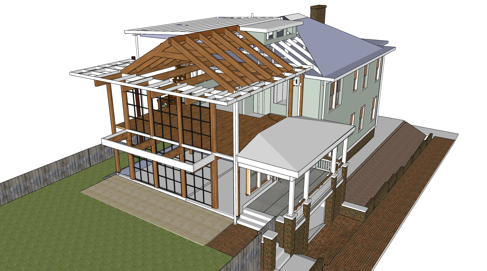
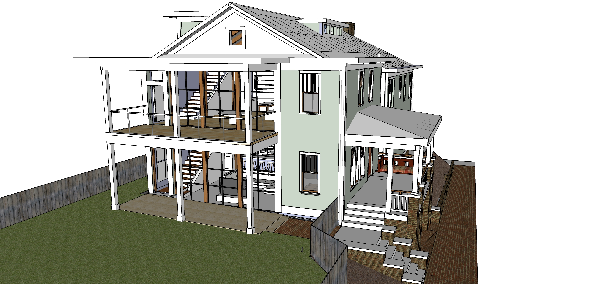
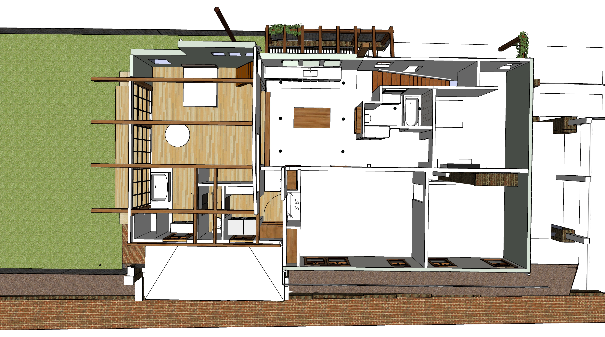
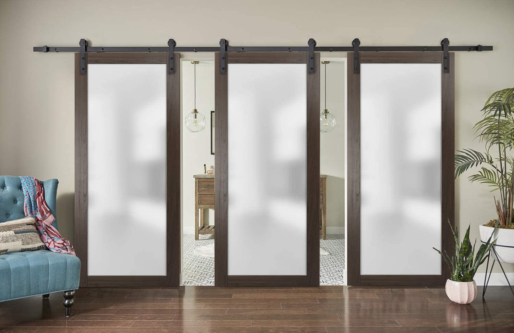
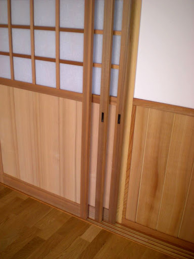
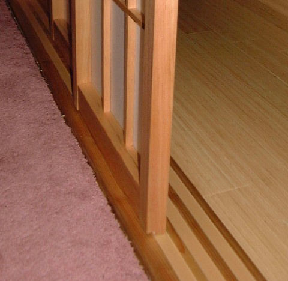
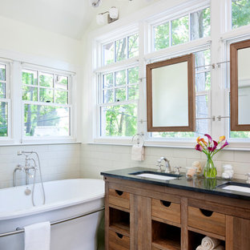

# Master and Attic Addtion

## Phase 6 - Framework, Roof, Insulation, Windows, Siding

<!--
	Expanded polystyrene (the white insulation made up of a lot of small beads bonded together) has an insulating value of 4 per inch thickness. Thus, if you used three one inch polystyrene boards together to make a wall that is 3 inches thick, the R value would be about 12, roughly 3 times better insulating than wood

	Contact for residential mass timber engineering recommendations
	"E+M discussed design challenges with engineers that have successfully completed mass timber projects"
	BRAD ELLINWOOD, PE
	https://www.emstructural.com/
	bellinwood@emstructural.com
-->

||||
|---|---|---|
| **Framework** | | |
| Framework including mass timber columns and attic roof (plus $10,000 in "[projects](../projects/)") Use wood removed from west side of roof to increase northeast height about 1.5 feet | $10,000 | $35,000 |
| Remove pulldown attic stairway while closing opening in joists. Retain attic stairs for temporary use within master bedroom. | $800 | $1,200 |
| Create north balcony by extending joists over bumpout. | $3,000 | $4,500 |
| Porch railings for attic porch | $800 | $1,200 |
| &nbsp; |||
| **Roofing and Siding** |||
| Roofing for entire house (white surface for solar, maybe [roof foam](https://dura-foam.com/products-services/recoating/uv-exposure/). Close existing attic vent) | $8,000 | $20,000 |
| Insulation on addition. Expanding soy-based foam in closed-cell application with R-value around 6.5 per inch | $1,500 | $3,800 | 
| Vacuum Insulated Panels (VIP) behind cubbies - [Optim-R 1" R37](https://www.kingspan.com/us/en-us/product-groups/insulation/insulation-boards/optim-r) | $500 | $800 | 
| Siding on addition | $4,000 | $7,000 | 
| &nbsp; |||
| **Exterior Doors and Windows** |||
| 2 exterior doors - west and south | $2,000 | $3,000 |
| Approximately 30 windows, including window between attic and master bedroom. Consider triple pane windows with argon fill - maybe on north side. If we use Passive solar windows, only top half of upper south windows. | $18,000 | $25,000 |
| May move windows from kitchens to south side | | |
| &nbsp; |||
| **North Storage Doors** |||
| Add strong metal door on north storage compartment | $400 | $1,000 |
| &nbsp; |||
|**Remove remaining west wall and old roof**|||
| Remove walls and old roof under newly added shed roof. | $1,000 | $2,000 |
| &nbsp; |||

  
 

  
   

 
  
<a href="../upstairs">Craft room details</a> 

## Phase 7 - Exterior Painting, Gutters, Replace or Seal Existing Storm Windows, Remove Bars

<!--
To get quote from: 
[overeducatedpainters.com](http://overeducatedpainters.com/)  
-->

|  |||
|---|---|---|
| Remove old storm windows and security bars, patch and repair | $800 | $2,000 |
| Prep and paint entire exterior | $8,000 | $12,000 |
| Add white storm windows - include some that open automatically with Google Home. | $10,000 | $18,000 |
| Gutters with leaf guards on addition | $1,000 | $2,000 |
| Copper gutter with leaf guard on north side of upper roof to reduce bacteria in future greywater system  | $500 | $800 |

## Phase 8 - Electric
||||
|---|---|---|
| Electrical work and lighting | $8,000 | $18,000 |
| Separate fuse boxes for new electric work. Located in basement and attic. Home automation opportunity?  | $800 | $1,500 |
| “Whole-house protector” $178 on Amazon for 140,000 amp Siemens FS140 Whole House Surge Protector. | $300 | $500 |

## Phase 9 - Mini-splits
| See [Mini-split locations](../livingroom/#minisplits) |||
|---|---|---|
| Two exterior mini-split units | $2,000 | $3,000 |
| Mini-split in Downstairs Kitchen | $1,800 | $2,500 | 
| Mini-split in south livingroom wall | $2,000 | $2,800 |
| Mini-split above upstairs bathroom | $2,000 | $2,800 |
| &nbsp; |||

## Phase 10 - Steps/Woodwork/Framing/Doors

<!-- (8' 11 9/16" by 4'5". Total width: 17' 1.25") -->
||||
|---|---|---|
| **Add Interior Steps** | | |
| Build 1 step on south side of living room | $900 | $1,200 |
| Build 1 step to master bedroom | $500 | $800 |
| Build 1 step to new bathrooms | $400 | $600 |
| &nbsp; |||
| **Sliding Wall - 4 Door Panels** | | |
| 4 large sliding barn doors or shoji screens between master bedroom and craft room  | $1,200 | $5,000 |

<!--
	Triple Barn Sliding Brown Doors 90"x96" with 14FT Rails
	Currently unavailable
	https://www.amazon.co.uk/Triple-Sliding-Planum-Chocolate-Frosted/dp/B07XM3ZKVK
-->

 
Loren's uncle may build sliding doors. Looking for more of a barn door style.   

 

## Phase 11 - Master Bathroom and Laundry Area

||||
|---|---|---|
| Fixtures in new bathroom, shower, tub, toilet, shelf-cabinets and laundry area | $5,000 | $8,000 |
| [Mirror in front of window](https://www.houzz.com/photos/mirror-in-front-of-window-phbr0lbl-bl~l_51234) | $400 | $800 |
| Wall cubbies in master bedroom - north wall | $500 | $800 |
| &nbsp; |||
| **Tile projects** | | |
| Tile in upstairs shower within new bathroom | $800 | $1,200 |
| Tile in downstairs kitchen | $800 | $1,200 |
| Tile in craftroom | $800 | $1,200 |

 

## Phase 12 - Grey Water System

2 attic grey water tanks will be used for BOTH toilet flushing and watering the yard.  
3 rain barrel tanks below the porch steps will be pumped into the 2 attic tanks.  
3 additional tanks in basement (optional)  

||||
|---|---|---|
| Purchase and place grey water tanks above master bedroom | $800 | $1,500 |
| Rain barrels and pipe hookup under south steps | $1,000 | $2,500 |
| Install tiny door, install tiny sunburst (Abbey) |  |  |

## Master and Attic Addtion Total

 

[Home](../) | [Phases](../phases/)