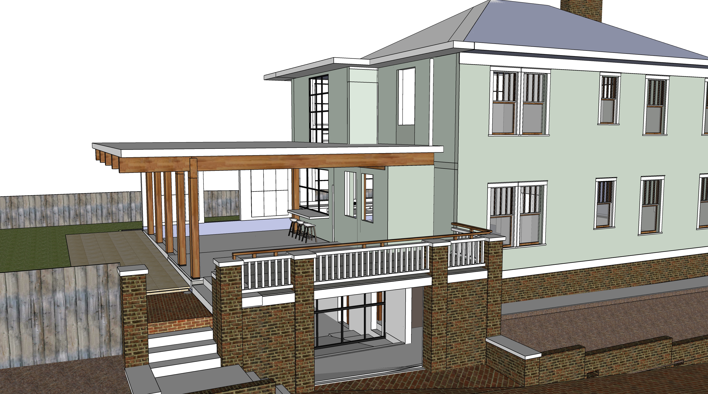
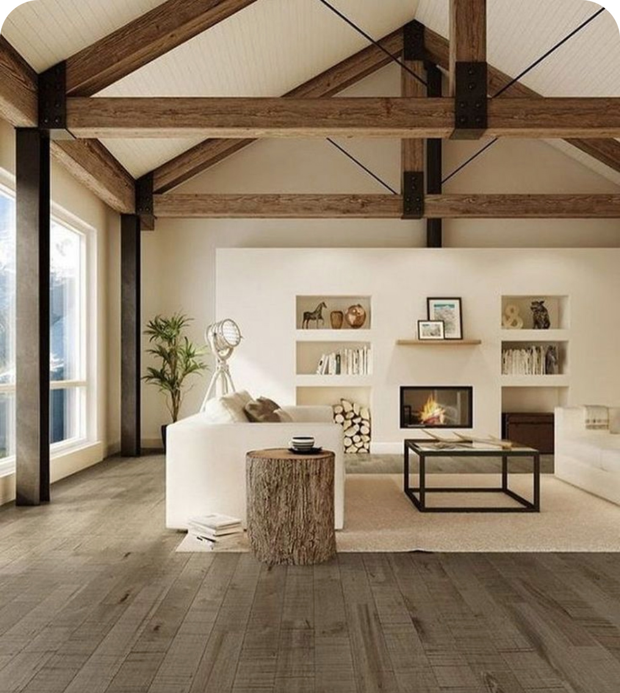
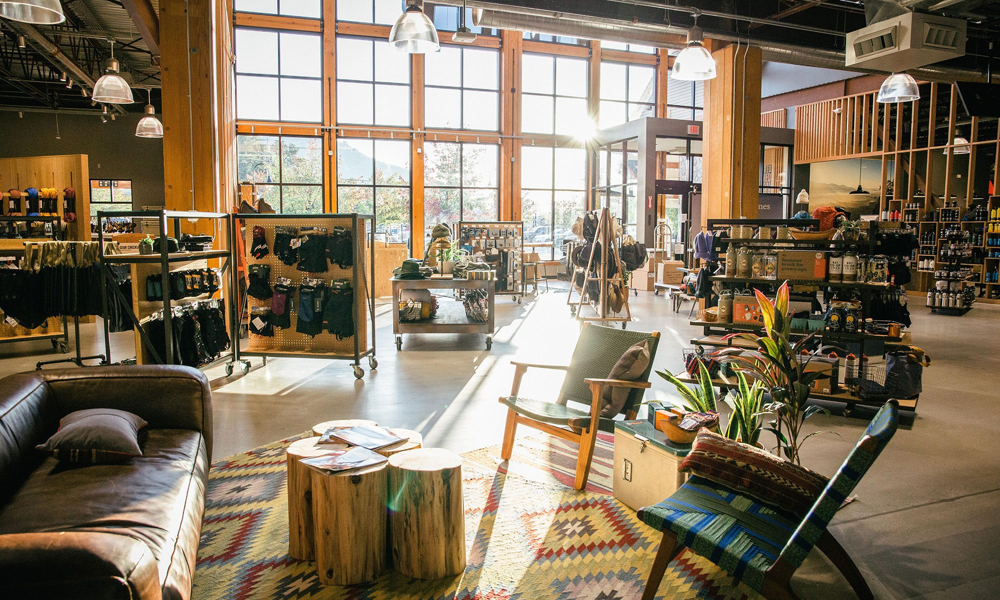
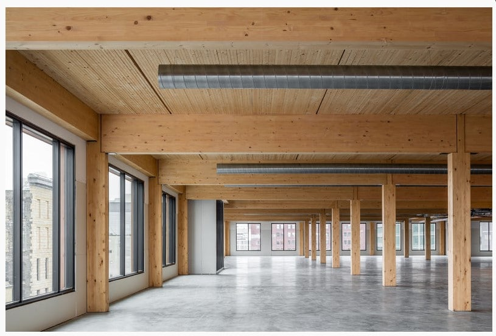
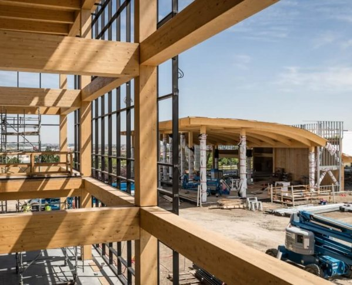

# Patio Area

- Mass timber surrounding patio is framework for future addition    

  

   

||||
|---|---|---|
| First level of mass Timber | $8,000 | $12,000 |
| "Base Isolated" House - pads under mass timber columns to dampen earthquake vibration | $800 | $1,000 |
| Roof of patio (future floor) using reclaimed 2x4s. Probably nail laminated. | $1,400 | $4,300 |
| Roofing material on patio. | $800 | $3,300 |
| Gutters on north and south sides.  Chains to drain west corners. | $600 | $800 |

 

<h2>Mass Timber Examples</h2>

  

<a href="https://model.earth/community/projects/wood/">Mass Timber Panels (Dowel or Nail Laminated)</a>  
[Kendeda Living Building](https://livingbuilding.gatech.edu/) - [Kendeda News](https://livingbuilding.gatech.edu/news/wsj-georgia-techs-kendeda-building-pits-latest-sustainable-tech-against-atlantas-swampy-climate)  

 

The patio is the lower level of the [Master Addition](../addition)  

Next: [Kitchen](../kitchen) and [Ongoing](../projects)
