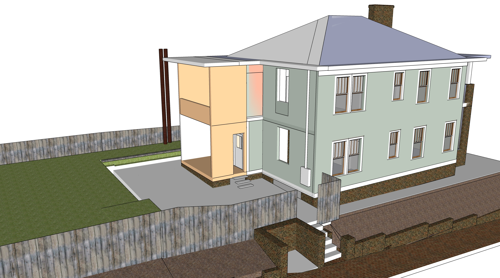

<!--
Renovation Construction Loan
Based on value of home at time of project completion

Dan uses calendly.com

To do: 

Floor Area Ratio (FAR) - 55%
https://www.investopedia.com/terms/f/floor-area-ratio.asp

Zero lot line variance - Add photos of neighbors on Bass
-->
# Construction Phases

<a href="sketchup/721-Grant-Street.skp">Download SketchUp Model</a> 

- 2021 - [Bathroom, Basement, Kitchen Bumpout](#planning) - Planning, new downstairs bathroom, basement, kitchen bumpout
- 2022 - [Upstairs Craft Room and Bathroom](../upstairs/) - Straighten stairway, upstairs bathroom, create downstairs pantry 
- 2022 - [Patio](../patio/) - Mass timber over patio  
- 2023 - [Ongoing Projects](../projects/) - Solar, move downstais electric box to basement
- 2027 - [Full Addition](../addition/) - Master bedroon, master bathroom, attic shed roofs

## Planning

- Prepare and submit plans to city using Sketchup where practical.

| | Min | Max |
|---|---|---|
| Ongoing pre-construction Planning. Work with engineers to finalize material orders. | $2,500 | $12,500 |

## New Downstairs Bathroom

- Located in former dining room on south side of house  
- Opening walls and ceiling for lighting and electric  
- Shower doors should slide over to front of toilet to allow for full access to side of tub.  
- Panel on south side of tub should pivot to wall.  

   

| | Min | Max |
|---|---|---|
| New Bathroom - We have a new tub and toilet to use.  Their color is almond. The tub needs to be set in tile.   | $4,000 | $10,000 |
| Tile and install | $2,000 | $4,000 |
| Towel warming rack | $300 | $500 |

## Relocate Gas Pipe

Gas pipe currently runs through kitchen pantries.  
Work can coincide with plumbing for new downstairs bathroom.  
 
- Loren will open downstairs north wall in coat closet for new pipe. 
- Pipe will reside in repositioned bathroom wall upstairs.
- Run pipe under plywood in attic to furnace. Loren will drill holes beforehand.
- Send gas to the water heater from above by reversing the flow of the pipe that currently goes to furnace in the attic.  
- Cap off former gas link at water heater.  
- Also remove unused gas pipe under porch to create more usable storage space.  

| | Min | Max |
|---|---|---|
| Relocating gas line. Loren will put holes through joists under plywood. | $800 | $1,800 |

 

Includes building portion of new wall for new gas pipe location. Vent pipes for the refrigerators and toilet will reside in the same wall:  
   
 

Later: Bathroom and stairway reconfigure during [upstairs projects](../upstairs).  
   

## Prior to Basement Dig

| Remove slate and rail road ties, Unhook AC units |||
|---|---|---|
| Jackhammer existing north cement for AC pad. Removed concrete can be used to fill void under kitchen bumpout. Initially store concrete on northeast side of house.  | $400 | $800 |
| Remove and dispose of creosote railroad ties. | $200 | $500 |
| Remove slate patio stones and concrete. Retain state for filler or reuse. Store under exterior stairway. Store concrete on northeast side of house. | $200 | $400 |

 
Before removal of laundry and tree(s)   

Loren will:  

Remove the rear laundry areas.  
Remove one of two trees that are close together, following approval by city. Using climbing harness to remove limbs.  
Work with local handyman to add more jacks under house.  
Remove brick wall where trash cans reside. Retain bricks for reuse.  

## Basement Dig and Pour

<!--
Possible resource: Fernando Garcia 404-538-2458 - Basement on Georgia Ave (July 2014) - Don't remember which house.
-->

- Adding the 4' basement stairway will occur after the adjacent basement wall is added so we have structural support while dirt is removed.

| **Temporarily unhook HVAC** | | |
|---|---|---|
| Remove freon and detach 2 AC units. Depending on weather, temporaily extend lines and move further east outside of fence | $100 | $700 |
| &nbsp; | | |
| **Basement Dig and Cement Work** | | |
| Basement Dig, Frame and Pour - includes sump pump and drain pipes | $10,000 | $30,000 |
| Pour cement pad for AC Units | $600 | $800 |
| North bump-out concrete foundation | $2,000 | $4,000 |
| Cement drain by porch with grate to catch leaves | $400 | $500 |
| Drains from brick porch area down to street below entrance, drain going east next to short brick wall | $800 | $1,500
| Pour higher basement level, 2 sets of cement steps and backing for brick walls on Bass Street | $1,000 | $2,500 |
| &nbsp; | | |
| **Basement Dig and Cement Work** | | |
| Dig area for basement stairs, pour additional concrete | $1,000 | $2,500 |

  
 
  

### Low Carbon Emission Concrete

Atlanta-based Thomas Concrete has been using the Canadian CarbonCure system since 2016.
[CNN Article](https://money.cnn.com/2018/06/12/technology/concrete-carboncure/index.html)  

"CarbonCure involves injecting carbon dioxide captured from various other industrial processes into concrete during the mixing process. A chemical reaction would “mineralize” that carbon dioxide, which would have the added benefit of making the concrete compressively stronger." “We have seen no downsides to using CarbonCure,”  Drew Millwood, the Thomas Concrete technician who oversaw the Kendeda job, writes: “It allows for cement reduction in any mix it is used in and provides strength at or above design. No cost increase is involved in a mix containing CO2 as the savings from cement reduction offset the cost of CO2 delivery. Equipment costs are easily recouped due to the savings.” - [source](https://livingbuilding.kendedafund.org/2019/07/16/carboncure/)  

## Hollow Core Slab (aka Coreslab)

| | | |
|---|---|---|
| **Hollow core install** | | |
| Hollow core slabs, lifted into place by crane on truck | $15,000 | $25,000 |
| Weatherproof plywood cover over basement stair opening, secure from below. Hinges on east side for access to basement stairway. | $100 | $400 |

 

  

8” slab + 2” concrete topping. 10” total.  

Hollow Core slabs and basement floor will provide a heat-sink in the main floor, storing heat generated from solar energy to radiate out at night.  

Electric heating will reside within basement floor to heat basement ceiling slab from below.  

  

  

[Concrete Industries - Indiana](https://concreteindustries.com/hollowcore/)
**Specs**  
[8" Hollowcore with 2" composite topping](https://concreteindustries.com/wp-content/uploads/2017/07/Hollowcore-Load-Table-2in-Composite.pdf)  
[8" Hollowcore with no composite topping](https://concreteindustries.com/wp-content/uploads/2017/07/Hollowcore-Load-Table-No-Composite.pdf)
  

<!--
 
-->

### Sources of Precast Concrete for Hollow Core

[Precast Concrete Suppliers serving Georgia](https://www.thomasnet.com/georgia/precast-concrete-17311002-1.html)  

[Precast Concrete Directory](https://www.pci.org/PCI/Directories/PCICertifiedPlants.aspx)  

### Concrete with Cellulose Nanocrystals

Cellulose nanocrystals provide an avenue for water to hydrate cement particles when mixing.  

Cellulose-infused concrete is stronger and sets faster  

[Purdue Researchers](https://www.purdue.edu/newsroom/releases/2018/Q1/purdue-researchers-show-concrete-infused-with-wood-nanocrystals-is-stronger,-plan-to-use-it-in-california-bridge.html)  
[Thomas parking lot in Greenville](http://www.thomasconcrete.com/latest-news/thomas-concrete-partners-in-the-debut-of-a-concrete-mix-infused-with-cellulosic-nanomaterial)  

## 2" Concrete Topping

||||
|---|---|---|
| Concrete Topping | $500 | $2000 |
| Three sets of steps at porch | $500 | $1000 |

 

## Basement Brickwork

- Basement, coreslab, brickwork, porch steps and rail.
- Move the exterior electric box.

- 2" of concrete on top of the coreslab to create a waterproof patio area. The surface will angle slightly to two drains on the west side.

- Basement exterior door, basement interior accordion windows

 
  

||||
|---|---|---|
| **Brickwork** | | |
| Porch tiles laid out for rain absorption as back porch | $400 | $800 |
| Brick patio area above stairway, weed barrier fabric, sand under bricks| $300 | $500 |
| Reset sidewalk (center third of Bass frontage, create side slope away from basement, weed barrier. (Other areas of Bass Street have vulnerable trees, so avoid resetting bricks by 2 oak trees and at front of property by Grant Street) | $800 | $1000 |
| Brick walls of porch | $1000 | $3000 |
| &nbsp; | | |

## Porch Railing Style

Not our house. For reference only...  

 

Waterflow at porch - Six levels of drain protection:

1. Area above stairs drains into pipe that outputs below porch.  
2. Downspout drains into three rain barrels within west side of porch, then outputs below porch.  
3. Sidewalk above stairs drains to outflow below porch.  
4. Sidewalk below stairs has a drain before doorway. Addition to sidewalk angles away from door.  
5. Goove below doors drains below porch.  
6. Interior floor angles away from deeper basement, which has a sump pump.  

 

---

## Bumpout

- 3' north side bumpout for two stories (minimum roof modifications)
- Windows on north and west side of kitchen and craft room

   

||||
|---|---|---|
| **Bumpout** | | |
| Bumpout and windows | $15,000 | $30,000 |
| Porch railings for lower south porch | $1,000 | $3,000 |
| Opening to bumpout area cut at small window beside the water heater upstairs. | $200 | $400 |

## Remove plaster and wood slats in downstairs kitchens

Loren will:  

Remove plaster and slats from ceiling in downstairs kitchen.  
Remove old gas and water pipes.  
Before removal, create envelope of plastic within room to prevent any dust from moving into house or falling between floor boards. Remove old pipes from within south wall of kitchen.  
Tie slats in bundles to prevent puncturing contrator bags.  
WILL NOT yet remove either side of exterior two walls on both levels.  
Carefully remove and retain door trim and baseboards from interior walls.  

Upstairs wall removal, craft room ceiling. upstairs counter and cabinets, closets.

Move water heater either into attic or below stairway.

## Downstairs Kitchen

- Downstairs kitchen, counters and cabinets
- The old bathroom will be converted to a pantry

||||
|---|---|---|
| **On both levels, remove kitchen ceiling plaster and one side of south wall.** | | |
| Park disposal truck at rear kitchen door for debris (plaster and wood slats). | $400 | $600 |
| Remove ceiling plaster and south interior wall plaster in both kitchens.  | $600 | $800 |
| &nbsp; | | |

||||
|---|---|---|
| **Plumbing** | | |
| Install new incoming valve under house to increase pressure. | $300 | $600 |
| Plumbing for new bathrooms, including pipe to attic. | $1,200 | $4,000 |  
| Move water heater to attic. Hook up water and gas lines. | $700 | $900 |
| Plumbing for sink in kitchen island. (4" Drain pipe already runs to kitchen. Add "T" to for new bathroom.) | $500 | $800 |
| Plumbing for sink in craftroom | $100 | $200 |

## Reposition existing AC units

||||
|---|---|---|
| **Reposition 2 AC Units into new enclosure** | | |
| Extend and insulate freon lines | $600 | $800 |
| Grate over AC units | $800 | $1,500 |
| &nbsp; | | |

Two exterior mini-split units will be added in a later phase.

## Basement sliding door and according window.

||||
|---|---|---|
| **Sliding door to basement. Basement stairway, Window within basement.** | | |
| Basement sliding doors adjacent to sidewalk | $2,000 | $5,000 |
| Metal stairway in basement | $1,000 | $4,000 |
| Basement window under porch. Black frame, an old factory look. Slides or swings open fully.  | $900 | $1,400 |
| &nbsp; | | |
| **Front Porch Steps** | | |
| Detachable wooden porch steps over rain barrel area | $500 | $800 |

  
  
 

  
  

 

 

---
[Next: Upstairs bathroom and craftroom](../upstairs/) 
