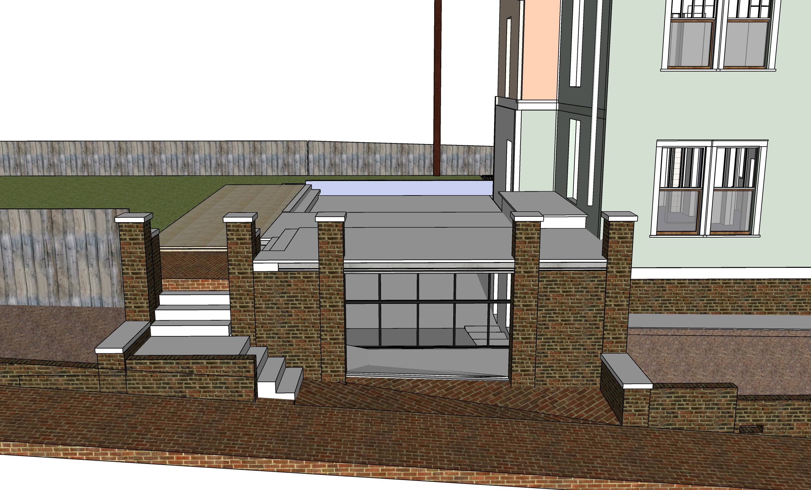

[721 Grant Street](../) - <a href="sketchup/721-Grant-Street.skp">Download SketchUp Model</a> 

<!--
Renovation Construction Loan
Based on value of home at time of project completion

Dan uses calendly.com

To do: 

Floor Area Ratio (FAR) - 55%
https://www.investopedia.com/terms/f/floor-area-ratio.asp

Zero lot line variance - Add photos of neighbors on Bass
-->
# Construction Phases

- [Construction Loan](#planning) - Planning, Add Downstairs Bathroom, Basement, Kitchen Bumpout
- [Upstairs with Cashout Financing](../upstairs/) - Straighten Stairway, Upstairs Bathroom
- [Ongoing Projects](../projects/) - Solar
- [Full Addition](../addition/) - Master Bedroon, Master Bathroom, Attic Shed Roofs

## Planning

- Prepare and submit plans to city. Advise on using Sketchup where practical.

| | Min | Max |
|---|---|---|
| Ongoing pre-construction Planning. Work with engineers to finalize material orders. | $2,500 | $12,500 |

## Relocate Gas Pipe

Gas pipe currently runs through kitchen pantries.  
Work can coincide with plumbing for new downstairs bathroom.  
 
- Loren will open downstairs coat closet nouth wall for new pipe. 
- Pipe will reside in repositioned bathroom wall upstairs.
- Run pipe under plywood in attic to furnace. Loren will drill holes beforehand.
- Send gas to the water heater from above by reversing the flow of the pipe that currently goes to furnace in the attic.  
- Cap off former gas link at water heater.  
- Also remove unused gas pipe under porch to create more usable storage space.  
 

Loren will build new wall for new pipe. Located by sewer air pipe and refridgerator vent:  
   

## New Downstairs Bathroom

- Located in former dining room on south side of house  
- Opening walls and ceiling for lighting and electric  

   

| | Min | Max |
|---|---|---|
| New Bathroom - We already have a new almond tub and almond toilet to use. Tub needs to be set in tile or wood. | $4,000 | $10,000 |
| Tile | $1,000 | $2,000 |
| Towel warming rack | $300 | $500 |

## Prior to Basement Dig

Loren will:  

Remove the rear laundry areas.  
Remove one of two trees that are close together, following approval by city. Using climbing harness to remove limbs.  

## Basement

<!--
Possible resource: Fernando Garcia 404-538-2458 - Basement on Georgia Ave (July 2014) - Don't remember which house.
-->

Before dig: 
   

  
 
  

 
  

| Prep for cement work |||
|---|---|---|
| Remove freon and detach two AC units (in the fall) | $25 | $200 |
| Jackhammer existing north cement for AC pad. Removed concrete might be used to fill void under kitchen bumpout. Store concrete on northeast side of house.  | $400 | $800 |
| Remove brick wall where trash cans reside. Retain bricks for reuse. | $400 | $600 |
| Remove slate patio stones and concrete. Retain state for filler or reuse. Store under exterior stairway. Store concrete on northeast side of house. | $200 | $400 |
| &nbsp; | | |
| **Basement/Cement Work** | | |
| Pour cement pad for AC Units | $600 | $800 |
| Basement Dig, Frame and Pour - includes sump pump and drain pipes | $10,000 | $30,000 |
| North bump-out foundation cement pour at same time | $2,000 | $4,000 |
| Cemeent drain by porch with grate to catch leaves | $400 | $500 |
| Drains from brick porch area down to street below entrance, drain going east next to short brick wall | $800 | $1,500
| Pour higher basement level, 2 sets of cement steps and backing for brick walls on Bass Street | $1,000 | $2,500 |
| &nbsp; | | |
| **Brickwork** | | |
| Porch tiles laid out for rain absorption as back porch | $400 | $800 |
| Brick patio area above stairway, weed barrier fabric, sand under bricks| $300 | $500 |
| Reset sidewalk (center third of Bass frontage, create side slope away from basement, weed barrier. (Other areas of Bass Street have vulnerable trees, so avoid resetting bricks by 2 oak trees and at front of property by Grant Street) | $800 | $1000 |
| Brick walls of porch | $1000 | $3000 |
| &nbsp; | | |
| **Hollow core install** | | |
| Hollow core slabs, lifted into place by crane on truck | $15,000 | $25,000 |
| Weatherproof plywood cover over basement stair opening, secure from below. Hinges on east side for access to basement stairway. | $100 | $400 |

## Basement Brickwork

- Basement, coreslab, brickwork, porch steps and rail.
- Move the exterior electric box.

- 2" of concrete on top of the coreslab to create a waterproof patio area. The surface will angle slightly to two drains on the west side.

- Basement exterior door, basement interior accordion windows

 
  

## Bumpout

- 3' north side bumpout for two stories (no additional roof modifications)
- Windows on north and west side of kitchen and craft room

   

   

Upstairs, the small window beside the water heater will be cut into a door to provide access to the 3' bumpout area.  

## Remove plaster and wood slats in downstairs kitchens

Loren will:  

Remove plaster and slats from ceiling in downstairs kitchen.  
Remove old gas and water pipes.  
Before removal, create envelope of plastic within room to prevent any dust from moving into house or falling between floor boards. Remove old pipes from within south wall of kitchen.  
Tie slats in bundles to prevent puncturing contrator bags.  
WILL NOT yet remove either side of exterior two walls on both levels.  
Carefully remove and retain door trim and baseboards from interior walls.  

Upstairs wall removal, craft room ceiling. upstairs counter and cabinets, closets.

Move water heater either into attic or below stairway.

## Downstairs Kitchen

- Downstairs kitchen, counters and cabinets
- Mass timber framework surrounding patio (optional)

The old bathroom will be converted to a pantry after the cashout so we appraise higher.

Adding the 4' basement stairway will occur after the adjacent basement wall is added so we have structural support while dirt is removed.

||||
|---|---|---|
| **On both levels, remove kitchen ceiling plaster and one side of south wall.** | | |
| Park disposal truck at rear kitchen door for debris (plaster and wood slats). | $400 | $600 |
| Remove ceiling plaster and south interior wall plaster in both kitchens.  | $600 | $800 |
| &nbsp; | | |
| **Add more supports in basement (with cemment footings and aluminum tops), repoint bricks** | | |
| Add cement bases and 3 to 5 metal poles in crawlspace to reinforce west side of house, and column areas under side of kitchen and sides of front entrance room wall which will be removed. | $800 | $1000 |
| Seal existing hole into crawl space after removing laundry area. Hole is about 2' tall by 3.5' wide. | $400 | $500 |
| Repoint existing bricks to add stability prior to basement dig. Repair crawlspace vent openings, patch wood holes. | $1,400 | $2,000 |

  

## Patio Area and Stairway to Basement

- Mass timber framework surrounding patio (cashout)
- One story structure over basement stair area (cashout)
- Dig area for basement stairs, additional concrete (cashout)

   

## Phase 5 - Move exterior AC units, add grate. Add basement door and window.

Two exterior mini-split units could also be added during this phase.

||||
|---|---|---|
| **Reposition 2 AC Units into new enclosure** | | |
| Extend and insulate freon lines | $600 | $800 |
| Grate over AC units | $800 | $1,500 |
| &nbsp; | | |
| **Sliding door to basement. Basement stairway, Window within basement.** | | |
| Basement sliding doors adjacent to sidewalk | $2,000 | $5,000 |
| Metal stairway in basement | $1,000 | $4,000 |
| Basement window under porch. Black frame, an old factory look. Slides or swings open fully.  | $900 | $1,400 |
| &nbsp; | | |
| **Front Porch Steps** | | |
| Detachable wooden porch steps over rain barrel area | $500 | $800 |

  
  
 

  
  

 

 

---
[Upstairs work with Cashout Financing](../upstairs/) 
