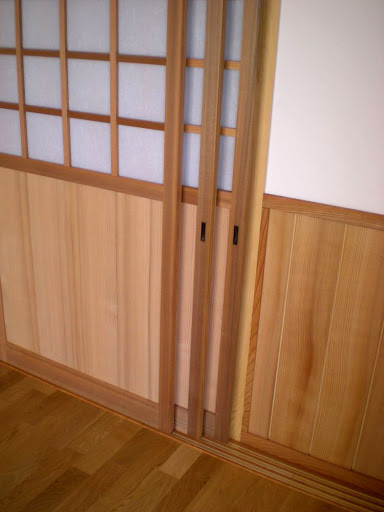
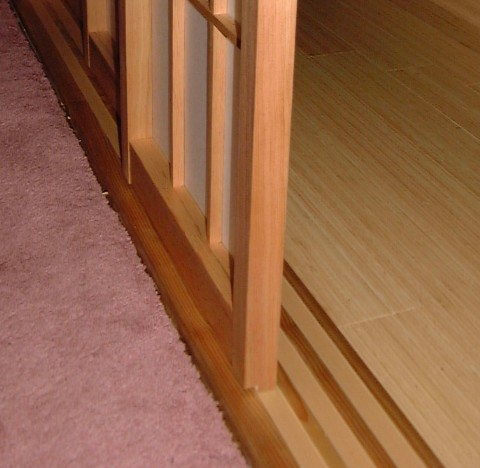
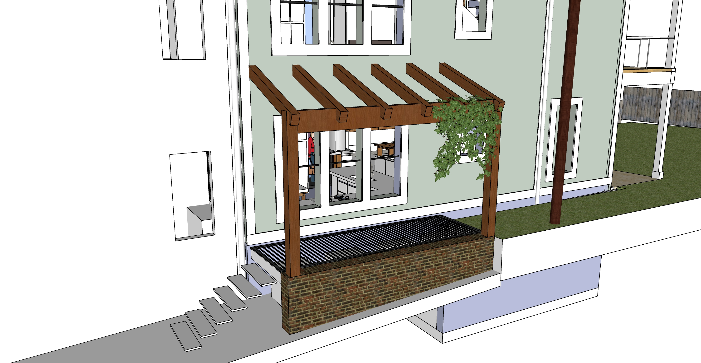

# Home Renovation - 2022

A 3 to 6 month renovation using cash out once addition completed.

## Chimney Cover
||||
|---|---|---|
|Around: 56 3/4" by 16 3/4" (Ideal interior: 18" or 17.5" by 57.25") Outer edge of bricks: 58" by 19"| $300 | $800 |

## Electrical
||||
|---|---|---|
| Move all existing wires to new fuse boxes (located in basement and attic) | $2,000 | $5,000 |
| Add 6 recessed lights in existing upstairs center bedroom (probably 3’ from corners). Dimmer switch on east wall. | $500 | $800 |

## Interior demolition, New support crossbeam in entrance room

|  |||
|---|---|---|
| Remove wall above former stairway to reduce weight. Plywood and plastic to catch dust/debris. | $300 | $600 |
| Open walls for access to pipes for upstairs tub drain | $200 | $400 |
| Add crossbeam and uprights and open wall in front room by former stairway. Remove wall. | $2,000 | $3,000 |
| Open wall between old TV room and small room. Open wall from small room to Ethan's bedroom | $400 | $800 |

## Expand entrance room, new showers and closets  

[Stairway removal project details](../initial)  

[Bathroom wall photos](https://docs.google.com/document/d/1J0A26a7-Dvm3mscBRTSgxIeMxft11VZoRADT_unegkE/edit?usp=sharing)  

|  |||
|---|---|---|
| **Add floor system and shower frame** | | |
| Add floor system in former stairway| $1,000 | $1,500 |
| Add framework and basin for shower in closet under stairs. | $800 | $1,200 |
| Move or install new fan vent. | $200 | $400 |
| Plumbing for showers, including pipe to attic. Hole in roof. | $1,200 | $3,000 |  
| &nbsp; |||
| **Drywall and Painting** | | |
| Open cracks in plaster, patch | $500 | $800 |
| Drywall in exisitng bathrooms. | $500| $800 |  
| Paint/stain | $200 | $700 |
| Paint existing bathrooms | $200 | $500 |
| Add new lights upstairs shower and closets | $400 | $1,500 |
| Lights in new downstairs shower | $200 | $600 |
| Hookup for towel warming rack in downstairs bathroom | $200 | $300 |
| &nbsp; |||
| <b>Downstairs Bathroom</b> | | |
| Add downstairs shower under stairway. Install pivoting towel shelf and vent. | $3,000 | $4,000 |
| &nbsp; |||
| **Upstairs Bathroom** | | |
| Add tub upstairs | $2,000 | $4,000 |
| Upstairs bathroom recessed lights and vanity light | $400 | $700 |
| Tile in downstairs shower | $800 | $1,200 |
| Tile in upstairs shower existing bathroom | $800 | $1,200 |

## Woodwork/Framing/Doors
||||
|---|---|---|
| **Add closet** |||
| Add closet and door by south porch entrance in new addition | $800 | $1,500 |
| &nbsp; |||
| **Sliding Wall - 4 Door Panels** | | |
| 4 large sliding barn doors or shoji screens between master bedroom and craft room (8'7" by 4'5") - Loren's uncle may build screens. Also considering other sliding wall options. | $1,200 | $3,000 |

<!--
	Triple Barn Sliding Brown Doors 90"x96" with 14FT Rails
	Currently unavailable
	https://www.amazon.co.uk/Triple-Sliding-Planum-Chocolate-Frosted/dp/B07XM3ZKVK
-->

 

 

## Craftroom
||||
|---|---|---|
| **East Counter** |||
| Extend countertop, Cabinets, Oven, Undercounter fridge | $3,000 | $5,200 |

 
<a href="https://www.google.com/search?q=fridge+under+counter&sxsrf=ALeKk02GU5j0dWZngOF80UpdOTu5UKlKqg:1614549505261&source=lnms&tbm=isch&sa=X&ved=2ahUKEwi7u-7NyY3vAhWCxFkKHWrKDOwQ_AUoAnoECAcQBA&biw=1536&bih=885&dpr=2#imgrc=QSgLMOCidC_flM">more undercounter examples</a>  

## Solar Panels
| New rebates are expected. List of [solar contractors in Georgia](https://www.solarpowerworldonline.com/2020-top-georgia-contractors/)  |||
|---|---|---|
| Solar panels  | $20,000 | $30,000 |

## Exterior Wood Structures
||||
|---|---|---|
| Wood structure for jasmin over exterior HVAC grate  | $1,500 | $2,000 |
| Wood archway beside front porch. Wood archway on south side. | $800 | $1,300 |

 

  
 

## Grey Water System

2 attic grey water tanks will be used for BOTH toilet flushing and watering the yard.  
3 rain barrel tanks below the porch steps will be pumped into the 2 attic tanks.  

||||
|---|---|---|
| Purchase and place grey water tanks above master bedroom | $800 | $1,500 |
| Rain barrels and pipe hookup under south steps | $1,000 | $2,500 |
| Install tiny door, install tiny sunburst (Abbey) |  |  |

## Crawlspace
||||
|---|---|---|
| Insulate kitchen floor in crawlspace. | $500 | $800 |
| <a href="https://docs.google.com/document/d/12DIpuRJvCAZmODl7M-jmEJEsM0hCdxiBljkXsaRpKSs/edit?usp=sharing">Crawl Space Encapsulation</a> | $2,000 | $5,000 |
| Existing front crawl space door - replace plywood with verticle boards. sand, stain and seal and lock. Dark stain color to blend with bricks | $300 | $500 |

## Porch Updates
||||
|---|---|---|
| Exterior fireplace with barbecue grill within stone enclosure. | $3,000 | $8,000 |
| Porch fireplace top with heat-transfer pipes connected to basement | $1,000 | $3,000 |
| Existing front porches: Remove 2 extra columns by bricks and add 2x11 in ceiling. New ceilings with recessed lighting, dimmer. Add molding. Trim repairs.  | $800 | $3,000 |

## Light-well
||||
|---|---|---|
| Add light-well material within elevator shaft to redirect light from dormer roof window. | $1,000 | $3,000 |

 

 

<!--
Brackers for hanging shovels reside on north side of chminey.  

Later, energy could be generated during drip irrigation on cloudy days by turning a small turbine with the descending water.  Turbine could by bypassed when higher pressure is used to water lawn. 2 antique tanks within the backside of the fireplace could hold additional water.
-->

[Home](../../) | [Phases](../)