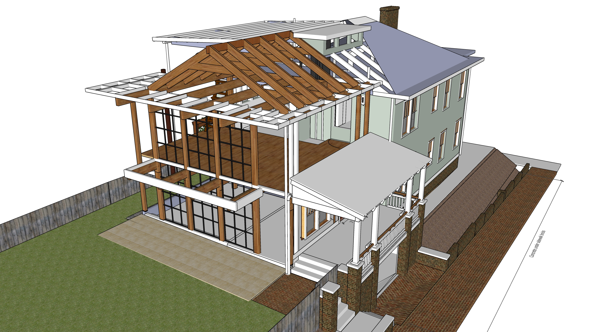
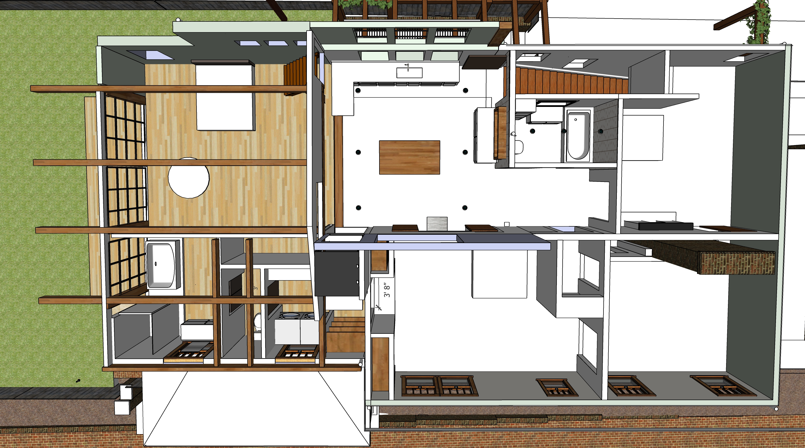
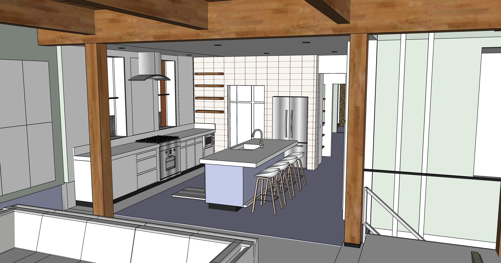
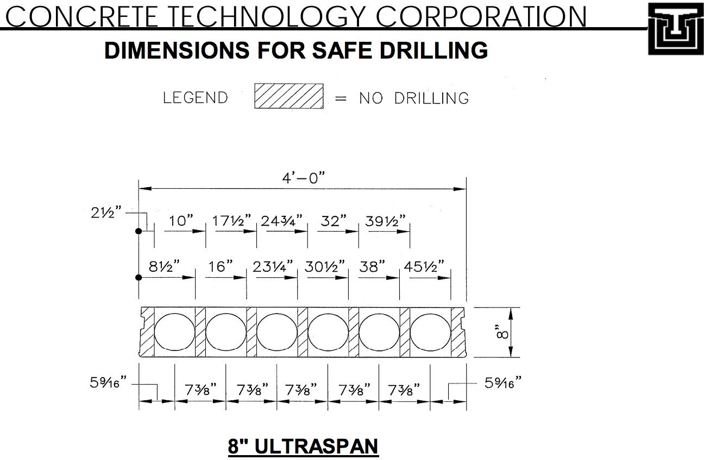
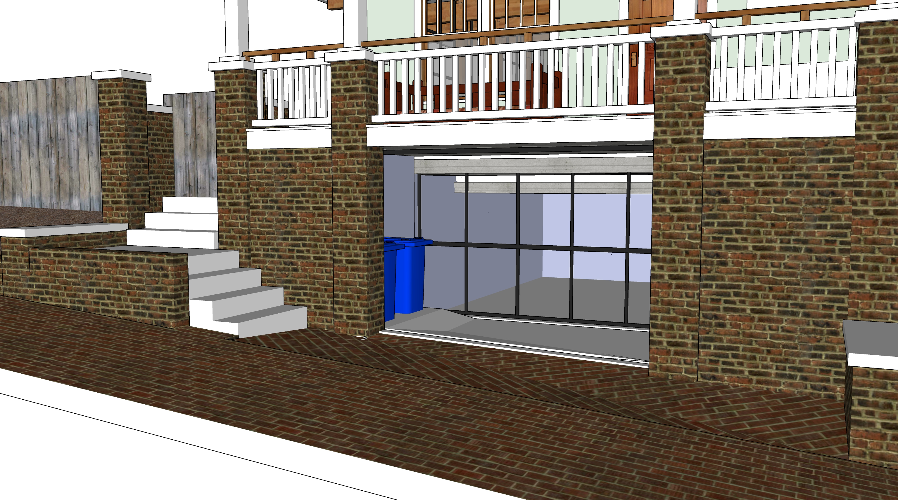

## Phase 6 - Framework, Roof, Insulation, Windows, Siding

<!--
	Expanded polystyrene (the white insulation made up of a lot of small beads bonded together) has an insulating value of 4 per inch thickness. Thus, if you used three one inch polystyrene boards together to make a wall that is 3 inches thick, the R value would be about 12, roughly 3 times better insulating than wood

	Contact for residential mass timber engineering recommendations
	"E+M discussed design challenges with engineers that have successfully completed mass timber projects"
	BRAD ELLINWOOD, PE
	https://www.emstructural.com/
	bellinwood@emstructural.com
-->

||||
|---|---|---|
| **Framework** | | |
| Framework including mass timber columns and attic roof Reuse wood from west side of roof for northeast roof height increase | $20,000 | $50,000 |
| "Base Isolated" House - pads under mass timber columns to dampen earthquake vibration | $500 | $1,000 |
| Remove pulldown attic stairway while adding or extending a couple joists. Temporarily reuse attic stairs within master bedroom. | $800 | $1,200 |
| Create balcony by attaching extensions to joists over new jut-out. | $3,000 | $4,500 |
| Porch railings for lower south porch | $2,000 | $3,000 |
| Porch railings for upstars west porch | $1,400 | $2,000 |
| Porch railings for attic porch | $800 | $1,200 |
| &nbsp; |||
| **Roofing and Siding** |||
| Roofing for entire house (white surface for solar, maybe [roof foam](https://dura-foam.com/products-services/recoating/uv-exposure/). Close existing attic vent) | $8,000 | $20,000 |
| Insulation on addition. Expanding soy-based foam in closed-cell application with R-value around 6.5 per inch | $1,500 | $3,800 | 
| Vacuum Insulated Panels (VIP) behind cubbies - [Optim-R 1" R37](https://www.kingspan.com/us/en-us/product-groups/insulation/insulation-boards/optim-r) | $500 | $800 | 
| Siding on addition | $4,000 | $7,000 | 
| &nbsp; |||
| **Exterior Doors and Windows** |||
| 2 exterior doors | $2,000 | $3,000 |
| Approximately 30 windows, including window between attic and master bedroom. Consider triple pane windows with argon fill - maybe on north side. If we use Passive solar windows, only top half of upper south windows. | $18,000 | $25,000 |
| May move windows from kitchens to south side | | |
| &nbsp; |||
| **Open wall as temporary doorway** |||
| Cut doorway at top of stairs under existing square window by water heater. Retain trim. | $400 | $500 |
| &nbsp; |||
| **North Storage Doors** |||
| Add strong metal door on north storage compartment | $400 | $1,000 |
| &nbsp; |||
|**Two Stairways (rough)**|||
| 2 wooden staircases (rough) | $1,000 | $2,000 |
| &nbsp; |||
|**Remove Old Roof**|||
| Remove old roof under newly added shed roof. | $1,000 | $2,000 |
| &nbsp; |||
| **Existing upstairs bathroom** | | |
| Craftroom walls and ceiling, move door frame to create bathroom sink area. Reinforce. | $1,000 | $2,000 |

  
 

  
 

## Phase 7 - Exterior Painting, Gutters, Replace or Seal Existing Storm Windows, Remove Bars

<!--
To get quote from: 
[overeducatedpainters.com](http://overeducatedpainters.com/)  
-->

|  |||
|---|---|---|
| Remove old storm windows and security bars, patch and repair | $800 | $2,000 |
| Prep and paint entire exterior | $8,000 | $12,000 |
| Add white storm windows - include some that open automatically with Google Home. | $10,000 | $18,000 |
| Gutters with leaf guards on addition | $1,000 | $2,000 |
| Copper gutter with leaf guard on north side of upper roof to reduce bacteria in future greywater system  | $500 | $800 |

## Phase 8 - Electric
||||
|---|---|---|
| Electrical work and lighting | $8,000 | $18,000 |
| Separate fuse boxes for new electric work. Located in basement and attic.  | $500 | $1,000 |
| “Whole-house protector” $178 on Amazon for 140,000 amp Siemens FS140 Whole House Surge Protector. | $300 | $500 |

## Phase 9 - Mini-splits, Plumbing
| [Mini-split locations](../livingroom/#minisplits) |||
|---|---|---|
| Two exterior mini-split units | $2,000 | $3,000 |
| Mini-split in Downstairs Kitchen | $1,800 | $2,500 | 
| Mini-split in south livingroom wall | $2,000 | $2,800 |
| Mini-split above upstairs bathroom | $2,000 | $2,800 |
| &nbsp; |||
| **Plumbing** | | |
| Install new incoming valve under house to increase pressure. | $300 | $600 |
| Plumbing for new bathrooms, including pipe to attic. | $1,200 | $4,000 |  
| Move gas line in attic under plywood. Holes through joists. | $400 | $800 |
| Move water heater to attic. Hook up water and gas lines. | $700 | $900 |
| Plumbing for sink in kitchen island. (4" Drain pipe already runs to kitchen. Add "T" to for new bathroom.) | $500 | $800 |
| Plumbing for sink in craftroom | $100 | $200 |

## Phase 10 - Drywall, Interior Trim, Interior Painting, Stairway Completion, Interior Doors
||||
|---|---|---|
| **Drywall and Painting** | | |
| Expand window opening into doorway to upstairs laundry area | $200 | $800 |
| Drywall new addition, kitchen and craftroom | $3,000 | $5,000 |
| Interior painting | $2,000 | $5,500 |
| Switch and plug covers | $400 | $800 |
| &nbsp; |||
| **New Stairways** | | |
| Complete main stairway with treads and hand rail | $2,000 | $3,500 |
| Carefully remove treads of existing front stairway for reuse as attic stairway. Resurface treads (Patch, sand, stain, seal). Might flip treads. | $800 | $1,200 |
| Complete attic stairway with reused treads and new hand rail | $400 | $800 |
| Build 3 step wood stairway and landing on south side of living room | $900 | $1,200 |
| Build 3 step wood stairway to master bedroom | $500 | $800 |
| Build 3 step wood stairway to new bathrooms | $400 | $600 |
| &nbsp; |||
| **Interior Trim and Door Carpentry** | | |
| Build bathroom door frame from our wood trim collection. Hang door. Use 1 of 5 doors in attic | $500 | $800 |
| Hang additional doors currently in attic | $800 | $1,200 |
| Large sliding bathroom door | $800 | $1,200 |
| Door Hardware - Repair/upgrade doorknobs - Front door, bedroom, upstairs bathroom | $400 | $800 |

## Phase 11 - Tile and counter projects
||||
|---|---|---|
| Disconnect old sink in craftroom. Retain garbage disposal. | $50 | $100 |
| &nbsp; |||
| **New bathroom and laundry area** | | |
| Fixtures in new bathroom, shelf-cabinets and laundry area | $10,000 | $15,000 |
| [Mirror in front of window](https://www.houzz.com/photos/mirror-in-front-of-window-phbr0lbl-bl~l_51234) | $400 | $800 |
| Wall cubbies in master bedroom - north wall | $500 | $800 |
| &nbsp; |||
| **Tile projects** | | |
| Tile in upstairs shower within new bathroom | $800 | $1,200 |
| Tile in downstairs kitchen | $800 | $1,200 |
| Tile in craftroom | $800 | $1,200 |

  
<a href="../kitchen/#craftroom">Craftroom Images</a> 
  
 

  
 

## Phase 12 - Craftroom and Kitchen - Counters and Cabinets
||||
|---|---|---|
| **Craftroom counter and sink** | | |
| Add new "L" shapped counter and cabinets with sink in craftroom. Tall cabinets on south side of craftroom. (At this point, family will shift to using craftroom while downstairs kitchen is remodeled.) | $1,800 | $3,500 |
| &nbsp; |||
| **Downstairs Kitchen -  Remove hallway walls, Ceiling, Extend floor 3'** | | |
| Deactivate existing downstairs kitchen plumbing, electricity, remove counters and remove wall behind sink (reuse windows) | $400 | $500 |
| Remove wall above doorway, remove south side of hall closet, add framework | $400 | $800 |
| Sliding door on east side of kitchen. Reinforce wall | $800 | $1,500 |
| Drywall kitchen ceiling | $400 | $800 |
| Extend downstairs kitchen hardwood floor surface 3' into bumpout and resurface floor with [PolyWhey® 3500 Satin](https://vermontnaturalcoatings.com/product/polywhey-3500-wood-floor-finish/) - PolyWhey 3500 has 65% less VOC content than the standard that most water-based finishes try to meet, while PolyWhey 2500 has 50% less. | $2,000 | $4,000 |
| &nbsp; |||
| **Downstairs Cabinetry** | | |
| Downstairs kitchen - "L" shapped counter, maybe quartz. Cabinets including south wall, sink, hookup dishwasher | $7,000 | $15,000 |
| Downstairs kitchen oven, either a hood or vent | $1,200 | $4,000 |
| Cabinet-size freezer for new kitchen - Might place upstairs as island initially | $1,400 | $1,800 |
| &nbsp; |||
| **Upstairs Cabinetry** | | |
| Upstairs craft room - cabinet on south wall | $1,500 | $1,800 |
| Craft room wood shelf | $400 | $600 |

  
 
<a href="../kitchen/">More Kitchen Images</a> 

 

 
---

# Basement Details

## Low Carbon Emission Concrete

Atlanta-based Thomas Concrete has been using the Canadian CarbonCure system since 2016.
[CNN Article](https://money.cnn.com/2018/06/12/technology/concrete-carboncure/index.html)  

"CarbonCure involves injecting carbon dioxide captured from various other industrial processes into concrete during the mixing process. A chemical reaction would “mineralize” that carbon dioxide, which would have the added benefit of making the concrete compressively stronger." “We have seen no downsides to using CarbonCure,”  Drew Millwood, the Thomas Concrete technician who oversaw the Kendeda job, writes: “It allows for cement reduction in any mix it is used in and provides strength at or above design. No cost increase is involved in a mix containing CO2 as the savings from cement reduction offset the cost of CO2 delivery. Equipment costs are easily recouped due to the savings.” - [source](https://livingbuilding.kendedafund.org/2019/07/16/carboncure/)  

## Hollow Core Concrete Slabs

<!--
  
 
-->
8” slab + 2” concrete topping. 10” total.  

Hollow Core slabs could provide a heat-sink in the main floor, storing heat generated from solar energy to radiate out at night.  Likely to use electric on basement floor to heat basement ceiling slab from below.

  

  

[Concrete Industries - Indiana](https://concreteindustries.com/hollowcore/)
**Specs**  
[8" Hollowcore with 2" composite topping](https://concreteindustries.com/wp-content/uploads/2017/07/Hollowcore-Load-Table-2in-Composite.pdf)  
[8" Hollowcore with no composite topping](https://concreteindustries.com/wp-content/uploads/2017/07/Hollowcore-Load-Table-No-Composite.pdf)
  

<!--
 
-->

### Sources of Precast Concrete for Hollow Core

[Precast Concrete Suppliers serving Georgia](https://www.thomasnet.com/georgia/precast-concrete-17311002-1.html)  

[Precast Concrete Directory](https://www.pci.org/PCI/Directories/PCICertifiedPlants.aspx)  

### Concrete with Cellulose Nanocrystals

Cellulose nanocrystals provide an avenue for water to hydrate cement particles when mixing.  

Cellulose-infused concrete is stronger and sets faster  

[Purdue Researchers](https://www.purdue.edu/newsroom/releases/2018/Q1/purdue-researchers-show-concrete-infused-with-wood-nanocrystals-is-stronger,-plan-to-use-it-in-california-bridge.html)  
[Thomas parking lot in Greenville](http://www.thomasconcrete.com/latest-news/thomas-concrete-partners-in-the-debut-of-a-concrete-mix-infused-with-cellulosic-nanomaterial)  

## Repointing Bricks

Sandstone mortar color, similar to left below. [Mortar Mix for Historic Homes](https://gpna.org/historic-home-care)  

 
  

A color more like our existing wall below than the red existing mortar...  

  
  

## Porch Railing Style

Not our house. For reference only...  

 

Waterflow at porch - Six levels of drain protection:

1. Area above stairs drains into pipe that outputs below porch.  
2. Downspout drains into three rain barrels within west side of porch, then outputs below porch.  
3. Sidewalk higher than stairs drains to outflow below porch below.  
4. Sidewalk lower than stairs has a drain before doorway.  Addition to sidewalk angles away from door.  
5. Goove below doors drains below porch.  
6. Interior floor angles away from deeper basement, which has a sump pump.  

 

---
