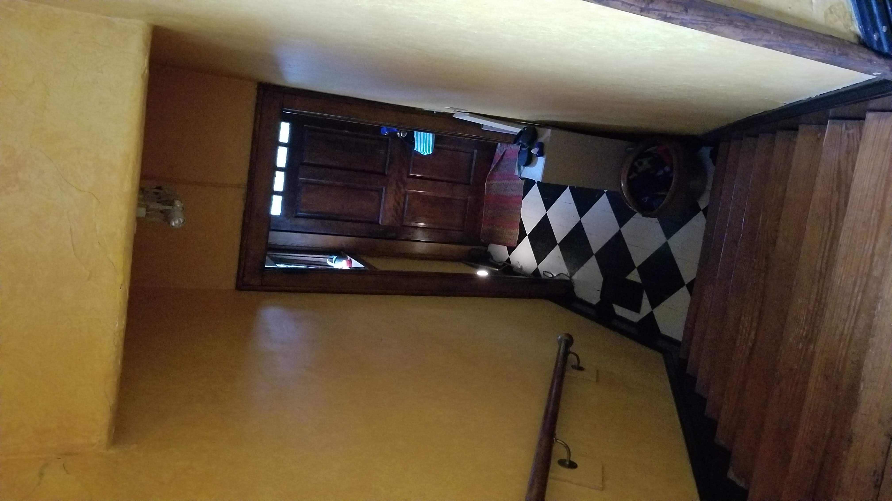

# Ongoing Projects

Most would be after [upstairs projects](../upstairs/)

## Repointing Bricks

One of these mortar colors, leaning toward darker (middle). [Mortar Mix for Historic Homes](https://gpna.org/historic-home-care)  

 
  

Our existing walls are too red... 

  

## Crawlspace
||||
|---|---|---|
| Insulate kitchen floor in crawlspace. | $500 | $800 |
| <a href="https://docs.google.com/document/d/12DIpuRJvCAZmODl7M-jmEJEsM0hCdxiBljkXsaRpKSs/edit?usp=sharing">Crawl Space Encapsulation</a> | $2,000 | $5,000 |
| Existing front crawl space door - replace plywood with verticle boards. sand, stain and seal and lock. Dark stain color to blend with bricks | $300 | $500 |

||||
|---|---|---|
| Repointing - Includes inside crawl space | $1,200 | $2,000 |
| **Add more supports in basement (with cement footings and aluminum tops), repoint bricks** | | |
| Add cement bases and 3 to 5 metal poles in crawlspace to reinforce west side of house, and column areas under side of kitchen and sides of front entrance room wall which will be removed. | $800 | $1000 |
| Seal existing hole into crawl space after removing laundry area. Hole is about 2' tall by 3.5' wide. | $400 | $500 |
| Repoint existing bricks to add stability prior to basement dig. Repair crawlspace vent openings, patch wood holes. | $1,400 | $2,000 |
 
## Chimney Cover
||||
|---|---|---|
|Around: 56 3/4" by 16 3/4" (Ideal interior: 18" or 17.5" by 57.25") Outer edge of bricks: 58" by 19"| $300 | $800 |

## Electrical
||||
|---|---|---|
| Move all existing wires to new fuse boxes (located in basement and attic) | $2,000 | $5,000 |
| Add 6 recessed lights in existing upstairs center bedroom (probably 3’ from corners). Dimmer switch on east wall. | $500 | $800 |

## Entrance Room - Remove closet and add bookshelf

Add new support crossbeam. Interior wall demolition.  
The wall above the stairway could be replaced with lighter drywall. A 45 degree angle will be added for head clearance.  
Compression of north wall causing plaster to bulge:

 

  

|  |||
|---|---|---|
| Remove entrance room closet. | $300 | $600 |
| Remove wall above stairway to reduce weight. Use plywood and plastic to catch dust/debris. | $300 | $600 |
| Add beam and open half of wall in front room by stairway. | $2,000 | $3,000 |
| Patch openings in floor. Resurface. | $800 | $2,000 |

<!--
## Exterior Spiral Stairway
||||
[Mylen Reroute 60"D](https://www.stairwayshop.com/mylen-reroute-60-d-primed-steel-spiral-stairways.html)

 
 
-->

## Solar Panels
| New rebates are expected. List of [solar contractors in Georgia](https://www.solarpowerworldonline.com/2020-top-georgia-contractors/)  |||
|---|---|---|
| Solar panels  | $20,000 | $30,000 |

## Pergola over HVAC units
||||
|---|---|---|
| Pergola wood structure for jasmin over exterior HVAC grate. Avoid blocking sun by using narrow overhead material. For longevity, need not be wood top. | $1,500 | $2,000 |
| Wood archway beside front porch. Wood archway on south side. See [Sierra Vinyl Arbor](https://www.wayfair.com/outdoor/pdp/new-england-arbors-sierra-vinyl-arbor-zne1182.html) | $800 | $1,300 |

 

  
 

## Front Porch Updates
||||
|---|---|---|
| Existing front porches:  New ceilings with recessed lighting, dimmer. Remove 2 extra columns by bricks and add 2x11 in ceiling. Add/update molding and trim where damaged or missing.  | $800 | $3,000 |

 Nice option if we ever screen one of the porches:

## Fire Pit
||||
|---|---|---|
| Add fire pit in back yard | $800 | $1,000 |

## Elevator

Slotted Metal Framing Strut Channel  
Motor and wench in attic for two redundant cables  

||||
|---|---|---|
| Power, brakes and cable system | $3,000 | $5,000 |
| Metal Cage and Doors | $3,000 | $7,000 |
| Automated doors at 3 levels | $4,000 | $7,000 |

<!--
Super Strut Carriage - 
10 ft. 12-Gauge Half Slotted Metal Framing Strut Channel - Silver Galvanized 

<iframe width="560" height="315" src="https://www.youtube.com/embed/39HlLf85LG4?start=614" frameborder="0" allow="accelerometer; autoplay; encrypted-media; gyroscope; picture-in-picture" allowfullscreen></iframe>

 
<iframe width="560" height="315" src="https://www.youtube.com/embed/CgdsamzPN8w?start=132" frameborder="0" allow="accelerometer; autoplay; encrypted-media; gyroscope; picture-in-picture" allowfullscreen></iframe>  

We could have 4 super strut carriages from Home Depot, with four wheels below and four above.
-->

## Light-well
||||
|---|---|---|
| Add light-well material within elevator shaft to redirect light from south attic window. | $1,000 | $3,000 |

 

 

<!--
Brackers for hanging shovels reside on north side of chminey.  

Later, energy could be generated during drip irrigation on cloudy days by turning a small turbine with the descending water.  Turbine could by bypassed when higher pressure is used to water lawn. 2 antique tanks within the backside of the fireplace could hold additional water.
-->

---
[Home](../) | [Phases](../phases/)