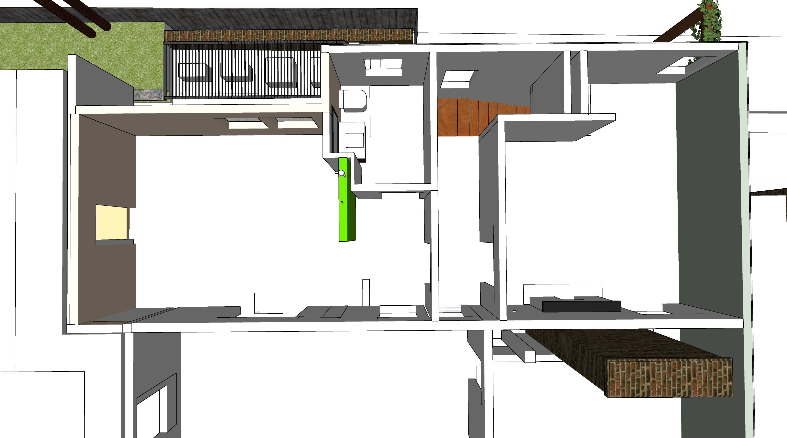
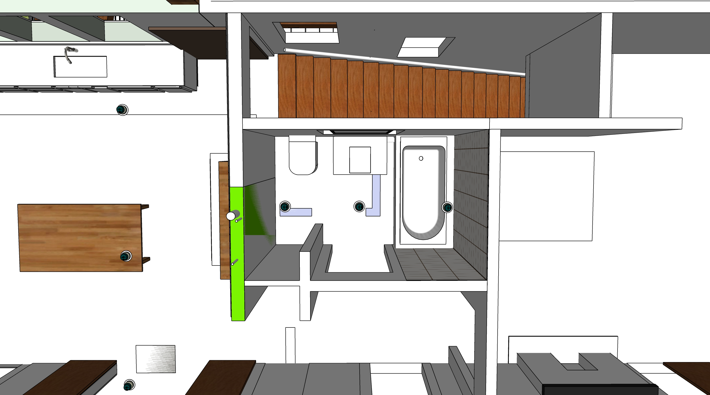
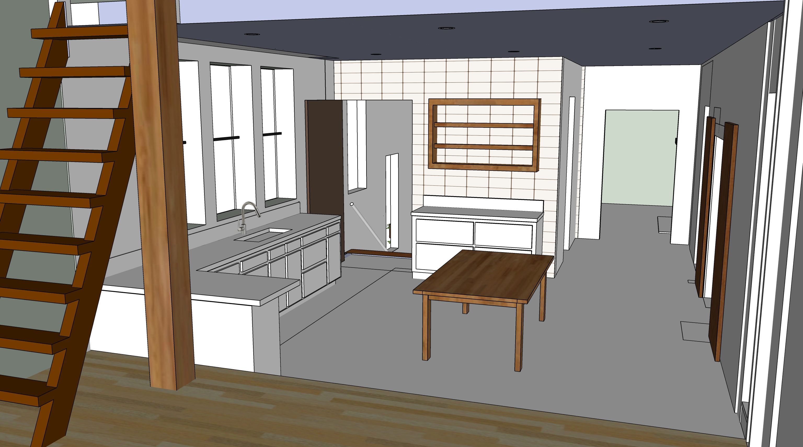

# Upstairs - Bathroom and Craft Room

- Work can begin with upstairs bathroom wall removal, new walls and reinforcement.  
- Water heater will be moved into attic by removing beam near attic ladder.  

  
Prior to moving walls and straightening stairway:  

 

  
After bumpout and moving walls:  
 

## Upstairs Bathroom  

Existing pipe locations: [Bathroom wall photos](https://docs.google.com/document/d/1J0A26a7-Dvm3mscBRTSgxIeMxft11VZoRADT_unegkE/edit?usp=sharing)  

|  |||
|---|---|---|
| After bumpout and new downstairs bathroom is added, straigten main stairway using existing treads. Two new hand rails | $2,000 | $3,500 |
| &nbsp; |||
| **Reconfigure floor system and shower frame** | | |
| Add floor system in former stairway. New walls. Add stairway door to Craft Room | $3,000 | $5,500 |
| Add framework and basin for tub or shower | $800 | $1,200 |
| Install new fan vent. | $200 | $400 |
| Plumbing, including pipe to attic. Hole in roof. | $1,200 | $3,000 |  
| &nbsp; |||
| **Drywall and Painting - Bathroom and Craft Room** | | |
| Open cracks in plaster, patch | $500 | $800 |
| Drywall | $500| $800 |  
| Paint/stain | $200 | $700 |
| &nbsp; |||
| **Upstairs Bathroom** | | |
| Add tub upstairs | $2,000 | $4,000 |
| Tile in upstairs shower | $800 | $1,200 |

 

Green wall with gas pipe added in prior phase:  

   

## Electrical

|  |||
|---|---|---|
| Add new lights - Craft room and Upstairs Bathroom. Upstairs bathroom recessed lights and vanity light  | $400 | $1,800 |

 

 

## Craft Room

Craftroom updates will occur during [kitchen updates](../kitchen)

 

  

  

  

<a href="https://www.google.com/search?q=fridge+under+counter&sxsrf=ALeKk02GU5j0dWZngOF80UpdOTu5UKlKqg:1614549505261&source=lnms&tbm=isch&sa=X&ved=2ahUKEwi7u-7NyY3vAhWCxFkKHWrKDOwQ_AUoAnoECAcQBA&biw=1536&bih=885&dpr=2#imgrc=QSgLMOCidC_flM">More undercounter examples</a>  

<!--
Bathroom

Genny Drash used Minwax Wood Finish (Penetrates, Stains & Seals) - Classic Grey 271 - for Poplar wood walls, no drywall 

-->

 

<!--
 
-->

[View Downstairs Kitchen](../kitchen/)

